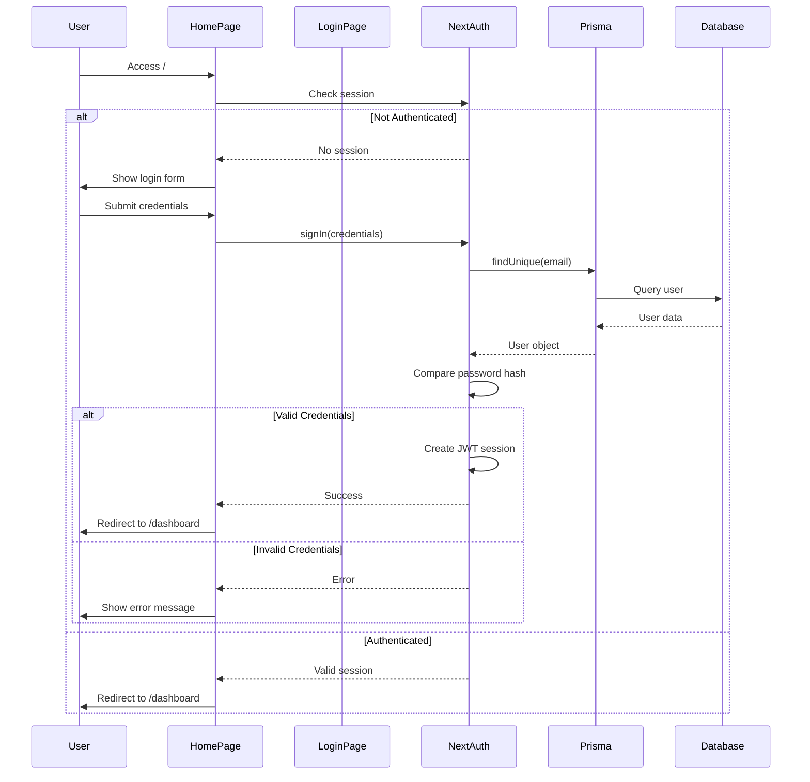

# Design Document: Home and Authentication Pages

## Overview

This design document outlines the implementation approach for creating a comprehensive authentication system for the MAIS Inventory Management System. The solution includes three main pages: a home page with login functionality, a dedicated login page, and a forgot password page. All pages will be implemented in English, following the existing design system, and fully integrated with the PostgreSQL database through Prisma ORM and NextAuth.js.

### Key Design Principles

1. **Consistency**: Use existing UI components and design patterns
2. **Security**: Implement secure authentication with proper password hashing and session management
3. **User Experience**: Provide clear feedback and smooth navigation flows
4. **Responsiveness**: Ensure all pages work seamlessly on mobile and desktop devices
5. **Integration**: Leverage existing authentication infrastructure (NextAuth.js, Prisma)

## Architecture

### High-Level Architecture

```
┌─────────────────────────────────────────────────────────────┐
│                         Client Layer                         │
│  ┌──────────────┐  ┌──────────────┐  ┌──────────────┐      │
│  │  Home Page   │  │  Login Page  │  │ Forgot Pass  │      │
│  │ (app/page)   │  │ ([locale]/   │  │    Page      │      │
│  │              │  │   login)     │  │              │      │
│  └──────┬───────┘  └──────┬───────┘  └──────┬───────┘      │
│         │                 │                  │               │
└─────────┼─────────────────┼──────────────────┼───────────────┘
          │                 │                  │
          ▼                 ▼                  ▼
┌─────────────────────────────────────────────────────────────┐
│                      API Layer (Server)                      │
│  ┌──────────────────────────────────────────────────────┐   │
│  │         NextAuth.js Authentication Service           │   │
│  │  - Credentials Provider                              │   │
│  │  - Session Management (JWT)                          │   │
│  │  - Password Verification (bcryptjs)                  │   │
│  └────────────────────┬─────────────────────────────────┘   │
│                       │                                      │
│  ┌────────────────────▼─────────────────────────────────┐   │
│  │         API Routes                                   │   │
│  │  - /api/auth/[...nextauth] (NextAuth handlers)      │   │
│  │  - /api/auth/forgot-password (Password reset)       │   │
│  └────────────────────┬─────────────────────────────────┘   │
└───────────────────────┼───────────────────────────────────────┘
                        │
                        ▼
┌─────────────────────────────────────────────────────────────┐
│                      Data Layer                              │
│  ┌──────────────────────────────────────────────────────┐   │
│  │              Prisma ORM Client                       │   │
│  │  - User Model Queries                                │   │
│  │  - Transaction Support                               │   │
│  └────────────────────┬─────────────────────────────────┘   │
│                       │                                      │
│  ┌────────────────────▼─────────────────────────────────┐   │
│  │           PostgreSQL Database                        │   │
│  │  - users table                                       │   │
│  │  - audit_logs table                                  │   │
│  └──────────────────────────────────────────────────────┘   │
└─────────────────────────────────────────────────────────────┘
```

### Authentication Flow



## Components and Interfaces

### 1. Home Page Component (`app/page.tsx`)

**Purpose**: Root landing page that handles initial authentication check and displays login form for unauthenticated users.

**Component Structure**:
```typescript
// Server Component
export default async function HomePage() {
  const session = await auth();
  
  if (session) {
    redirect('/en/dashboard');
  }
  
  return <HomeLoginForm />;
}
```

**Client Component** (`HomeLoginForm`):
```typescript
'use client';

interface LoginFormData {
  email: string;
  password: string;
}

interface LoginFormErrors {
  email?: string;
  password?: string;
  general?: string;
}

export function HomeLoginForm() {
  const [formData, setFormData] = useState<LoginFormData>({
    email: '',
    password: ''
  });
  const [errors, setErrors] = useState<LoginFormErrors>({});
  const [isLoading, setIsLoading] = useState(false);
  
  const handleSubmit = async (e: FormEvent) => {
    // Validation and authentication logic
  };
  
  return (
    // JSX with form UI
  );
}
```

### 2. Login Page Component (`src/app/[locale]/login/page.tsx`)

**Purpose**: Dedicated login page with full branding and internationalization support.

**Component Structure**:
```typescript
// Server Component
export default async function LoginPage({
  params,
  searchParams,
}: {
  params: Promise<{ locale: string }>;
  searchParams: Promise<{ callbackUrl?: string; error?: string }>;
}) {
  const session = await auth();
  const { locale } = await params;
  const { callbackUrl, error } = await searchParams;
  
  if (session) {
    redirect({ href: '/dashboard', locale });
  }
  
  return <LoginForm callbackUrl={callbackUrl} error={error} />;
}
```

**Client Component** (`LoginForm`):
```typescript
'use client';

interface LoginFormProps {
  callbackUrl?: string;
  error?: string;
}

export function LoginForm({ callbackUrl, error }: LoginFormProps) {
  // Similar structure to HomeLoginForm but with additional features
  // - Callback URL handling
  // - Link to forgot password
  // - Error message from URL params
}
```

### 3. Forgot Password Page (`src/app/[locale]/forgot-password/page.tsx`)

**Purpose**: Allow users to request password reset.

**Component Structure**:
```typescript
// Server Component
export default async function ForgotPasswordPage({
  params,
}: {
  params: Promise<{ locale: string }>;
}) {
  const session = await auth();
  const { locale } = await params;
  
  if (session) {
    redirect({ href: '/dashboard', locale });
  }
  
  return <ForgotPasswordForm />;
}
```

**Client Component** (`ForgotPasswordForm`):
```typescript
'use client';

interface ForgotPasswordFormData {
  email: string;
}

export function ForgotPasswordForm() {
  const [email, setEmail] = useState('');
  const [isSubmitted, setIsSubmitted] = useState(false);
  const [error, setError] = useState('');
  const [isLoading, setIsLoading] = useState(false);
  
  const handleSubmit = async (e: FormEvent) => {
    // Email validation and API call
  };
  
  return (
    // JSX with form UI or success message
  );
}
```

### 4. Forgot Password API Route (`src/app/api/auth/forgot-password/route.ts`)

**Purpose**: Handle password reset requests.

**API Interface**:
```typescript
// POST /api/auth/forgot-password
interface ForgotPasswordRequest {
  email: string;
}

interface ForgotPasswordResponse {
  success: boolean;
  message: string;
}

export async function POST(request: Request): Promise<Response> {
  // 1. Validate email format
  // 2. Check if user exists in database
  // 3. Generate password reset token (future enhancement)
  // 4. Return success message (don't reveal if email exists)
}
```

## Data Models

### User Model (Existing - from Prisma Schema)

```prisma
model User {
  id            String    @id @default(uuid())
  email         String    @unique
  name          String
  password      String    // bcrypt hashed
  role          UserRole  @default(DATA_ENTRY)
  isActive      Boolean   @default(true)
  preferences   Json?     @default("{}")
  createdAt     DateTime  @default(now())
  updatedAt     DateTime  @updatedAt
  
  // Relations
  inventoryItems InventoryItem[]
  auditLogs      AuditLog[]
  reports        Report[]
  backups        Backup[]
  systemSettings SystemSettings[]
}

enum UserRole {
  ADMIN
  DATA_ENTRY
  SUPERVISOR
  MANAGER
  AUDITOR
}
```

### Admin User Seed Data

```typescript
{
  email: 'yazeed@mais.com',
  name: 'Yazeed',
  password: await hash('Yazeed12345', 12), // bcrypt hash
  role: 'ADMIN',
  isActive: true,
  preferences: {}
}
```

## Error Handling

### Client-Side Validation

**Email Validation**:
```typescript
function validateEmail(email: string): string | undefined {
  if (!email) {
    return 'Email is required';
  }
  
  const emailRegex = /^[^\s@]+@[^\s@]+\.[^\s@]+$/;
  if (!emailRegex.test(email)) {
    return 'Please enter a valid email address';
  }
  
  return undefined;
}
```

**Password Validation**:
```typescript
function validatePassword(password: string): string | undefined {
  if (!password) {
    return 'Password is required';
  }
  
  if (password.length < 6) {
    return 'Password must be at least 6 characters';
  }
  
  return undefined;
}
```

### Server-Side Error Handling

**Authentication Errors**:
```typescript
enum AuthError {
  INVALID_CREDENTIALS = 'Invalid email or password',
  USER_INACTIVE = 'Your account has been deactivated',
  DATABASE_ERROR = 'An error occurred. Please try again',
  RATE_LIMIT = 'Too many login attempts. Please try again later',
}
```

**Error Response Format**:
```typescript
interface ErrorResponse {
  error: string;
  code?: string;
  details?: Record<string, string>;
}
```

### Error Display Strategy

1. **Field-level errors**: Display below the specific input field
2. **Form-level errors**: Display at the top of the form in a prominent alert
3. **Toast notifications**: Use for success messages and non-critical errors
4. **Loading states**: Show spinner on submit button during authentication

## UI/UX Design

### Design System Components

All pages will use existing UI components from `src/components/ui/`:
- `Card`, `CardHeader`, `CardTitle`, `CardContent` - Container components
- `Input` - Text input with label, error, and helper text support
- `Button` - Primary action button with loading state
- `Toast` - Notification system (react-hot-toast)

### Layout Structure

**Home Page Layout**:
```
┌─────────────────────────────────────────────┐
│                                             │
│              [Centered Content]             │
│                                             │
│  ┌───────────────────────────────────────┐  │
│  │         Saudi Mais Co.                │  │
│  │  Medical Products Inventory Mgmt      │  │
│  │                                       │  │
│  │  ┌─────────────────────────────────┐ │  │
│  │  │ Email                           │ │  │
│  │  │ [input field]                   │ │  │
│  │  └─────────────────────────────────┘ │  │
│  │                                       │  │
│  │  ┌─────────────────────────────────┐ │  │
│  │  │ Password                        │ │  │
│  │  │ [input field]                   │ │  │
│  │  └─────────────────────────────────┘ │  │
│  │                                       │  │
│  │  [Sign In Button]                     │  │
│  │                                       │  │
│  │  Forgot password?                     │  │
│  └───────────────────────────────────────┘  │
│                                             │
└─────────────────────────────────────────────┘
```

**Login Page Layout** (Similar to Home Page but with additional branding):
```
┌─────────────────────────────────────────────┐
│                                             │
│              [Centered Content]             │
│                                             │
│  ┌───────────────────────────────────────┐  │
│  │      [Logo/Icon - Optional]           │  │
│  │         Saudi Mais Co.                │  │
│  │  Medical Products Inventory Mgmt      │  │
│  │                                       │  │
│  │  [Error Alert - if present]           │  │
│  │                                       │  │
│  │  ┌─────────────────────────────────┐ │  │
│  │  │ Email                           │ │  │
│  │  │ [input field]                   │ │  │
│  │  │ [error message]                 │ │  │
│  │  └─────────────────────────────────┘ │  │
│  │                                       │  │
│  │  ┌─────────────────────────────────┐ │  │
│  │  │ Password                        │ │  │
│  │  │ [input field]                   │ │  │
│  │  │ [error message]                 │ │  │
│  │  └─────────────────────────────────┘ │  │
│  │                                       │  │
│  │  [Sign In Button with loading]        │  │
│  │                                       │  │
│  │  Forgot password?                     │  │
│  └───────────────────────────────────────┘  │
│                                             │
└─────────────────────────────────────────────┘
```

**Forgot Password Page Layout**:
```
┌─────────────────────────────────────────────┐
│                                             │
│              [Centered Content]             │
│                                             │
│  ┌───────────────────────────────────────┐  │
│  │      Reset Your Password              │  │
│  │                                       │  │
│  │  Enter your email address and we'll   │  │
│  │  help you reset your password.        │  │
│  │                                       │  │
│  │  ┌─────────────────────────────────┐ │  │
│  │  │ Email                           │ │  │
│  │  │ [input field]                   │ │  │
│  │  │ [error message]                 │ │  │
│  │  └─────────────────────────────────┘ │  │
│  │                                       │  │
│  │  [Send Reset Link Button]             │  │
│  │                                       │  │
│  │  ← Back to login                      │  │
│  └───────────────────────────────────────┘  │
│                                             │
└─────────────────────────────────────────────┘
```

### Responsive Design

**Breakpoints** (using Tailwind CSS):
- Mobile: < 640px (sm)
- Tablet: 640px - 1024px (sm to lg)
- Desktop: > 1024px (lg+)

**Mobile Optimizations**:
- Full-width cards with minimal padding on mobile
- Larger touch targets for buttons (min 44px height)
- Stack form elements vertically
- Adjust font sizes for readability

**CSS Classes**:
```css
/* Container */
.auth-container {
  @apply min-h-screen flex items-center justify-center bg-background p-4;
}

/* Card */
.auth-card {
  @apply w-full max-w-md;
}

/* Form spacing */
.auth-form {
  @apply space-y-4;
}
```

## Testing Strategy

### Unit Tests

**Components to Test**:
1. `HomeLoginForm` - Form validation, submission, error handling
2. `LoginForm` - Form validation, callback URL handling, error display
3. `ForgotPasswordForm` - Email validation, success state
4. Validation functions - Email and password validation logic

**Test Cases**:
```typescript
describe('LoginForm', () => {
  it('should display validation errors for empty fields', () => {});
  it('should display validation error for invalid email format', () => {});
  it('should call signIn with correct credentials', () => {});
  it('should display error message on authentication failure', () => {});
  it('should show loading state during submission', () => {});
  it('should redirect to callback URL on success', () => {});
});
```

### Integration Tests

**Authentication Flow Tests**:
1. Complete login flow with valid credentials
2. Login attempt with invalid credentials
3. Session persistence after successful login
4. Redirect behavior for authenticated users
5. Forgot password email submission

### Manual Testing Checklist

- [ ] Home page redirects authenticated users to dashboard
- [ ] Login form validates email format
- [ ] Login form validates password presence
- [ ] Successful login redirects to dashboard
- [ ] Failed login shows error message
- [ ] Admin account (yazeed@mais.com) can log in
- [ ] Forgot password page accepts email
- [ ] Forgot password shows success message
- [ ] All pages are responsive on mobile
- [ ] Loading states display correctly
- [ ] Error messages are clear and helpful
- [ ] Links between pages work correctly

## Security Considerations

### Password Security

1. **Hashing**: Use bcryptjs with salt rounds of 12
2. **Storage**: Never store plain text passwords
3. **Transmission**: Always use HTTPS in production
4. **Validation**: Enforce minimum password length (6 characters)

### Session Security

1. **JWT Tokens**: Use NextAuth.js JWT strategy
2. **HttpOnly Cookies**: Prevent XSS attacks
3. **Secure Flag**: Enable in production
4. **SameSite**: Set to 'lax' or 'strict'
5. **Expiration**: Configure appropriate session timeout

### CSRF Protection

NextAuth.js provides built-in CSRF protection through:
- CSRF tokens in forms
- Double-submit cookie pattern
- Origin validation

### Rate Limiting

Implement rate limiting on authentication endpoints:
- Max 5 login attempts per IP per 15 minutes
- Max 3 forgot password requests per email per hour

### Input Sanitization

1. **Email**: Validate format and sanitize input
2. **Password**: No sanitization (preserve exact input for hashing)
3. **SQL Injection**: Prisma ORM provides protection
4. **XSS**: React automatically escapes output

## Database Integration

### Prisma Client Usage

**Authentication Query**:
```typescript
const user = await prisma.user.findUnique({
  where: { email: credentials.email },
  select: {
    id: true,
    email: true,
    name: true,
    password: true,
    role: true,
    isActive: true,
  },
});
```

**Password Reset Query**:
```typescript
const user = await prisma.user.findUnique({
  where: { email: email },
  select: {
    id: true,
    email: true,
    isActive: true,
  },
});
```

### Database Seeding

Update `src/db/seed.ts` to include admin user:

```typescript
import { hash } from 'bcryptjs';

async function seedAdminUser() {
  const adminEmail = 'yazeed@mais.com';
  
  // Check if admin already exists
  const existingAdmin = await prisma.user.findUnique({
    where: { email: adminEmail },
  });
  
  if (!existingAdmin) {
    await prisma.user.create({
      data: {
        email: adminEmail,
        name: 'Yazeed',
        password: await hash('Yazeed12345', 12),
        role: 'ADMIN',
        isActive: true,
        preferences: {},
      },
    });
    console.log('✅ Admin user created');
  } else {
    console.log('ℹ️  Admin user already exists');
  }
}
```

### Audit Logging

Log authentication events:
```typescript
await prisma.auditLog.create({
  data: {
    userId: user.id,
    action: 'LOGIN',
    entityType: 'USER',
    entityId: user.id,
    ipAddress: request.headers.get('x-forwarded-for') || 'unknown',
    userAgent: request.headers.get('user-agent') || 'unknown',
    timestamp: new Date(),
  },
});
```

## Implementation Notes

### File Structure

```
app/
  page.tsx                              # Home page with login (NEW)

src/
  app/
    [locale]/
      login/
        page.tsx                        # Login page (UPDATE)
      forgot-password/
        page.tsx                        # Forgot password page (NEW)
    api/
      auth/
        [...nextauth]/
          route.ts                      # NextAuth handlers (EXISTS)
        forgot-password/
          route.ts                      # Forgot password API (NEW)
  
  components/
    auth/
      HomeLoginForm.tsx                 # Home page login form (NEW)
      LoginForm.tsx                     # Login page form (NEW)
      ForgotPasswordForm.tsx            # Forgot password form (NEW)
  
  db/
    seed.ts                             # Database seeding (UPDATE)
  
  services/
    auth.ts                             # NextAuth configuration (EXISTS)
```

### Dependencies

All required dependencies are already installed:
- `next-auth@5.0.0-beta.25` - Authentication
- `bcryptjs@2.4.3` - Password hashing
- `@prisma/client@6.1.0` - Database ORM
- `react-hot-toast@2.4.1` - Toast notifications
- `zod@3.24.1` - Schema validation (optional)

### Environment Variables

Required in `.env`:
```bash
DATABASE_URL="postgresql://..."
NEXTAUTH_URL="http://localhost:3000"
NEXTAUTH_SECRET="your-secret-key"
```

## Future Enhancements

1. **Email Integration**: Send actual password reset emails
2. **Password Reset Tokens**: Implement secure token-based password reset
3. **Two-Factor Authentication**: Add 2FA support
4. **Remember Me**: Implement persistent sessions
5. **Social Login**: Add OAuth providers (Google, Microsoft)
6. **Account Lockout**: Lock accounts after multiple failed attempts
7. **Password Strength Meter**: Visual feedback on password strength
8. **Internationalization**: Add Arabic language support for auth pages
